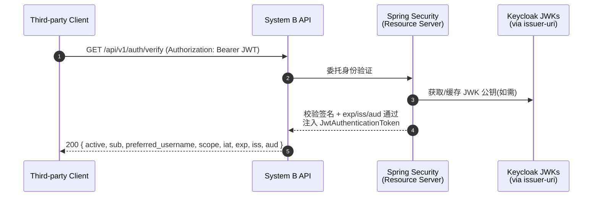
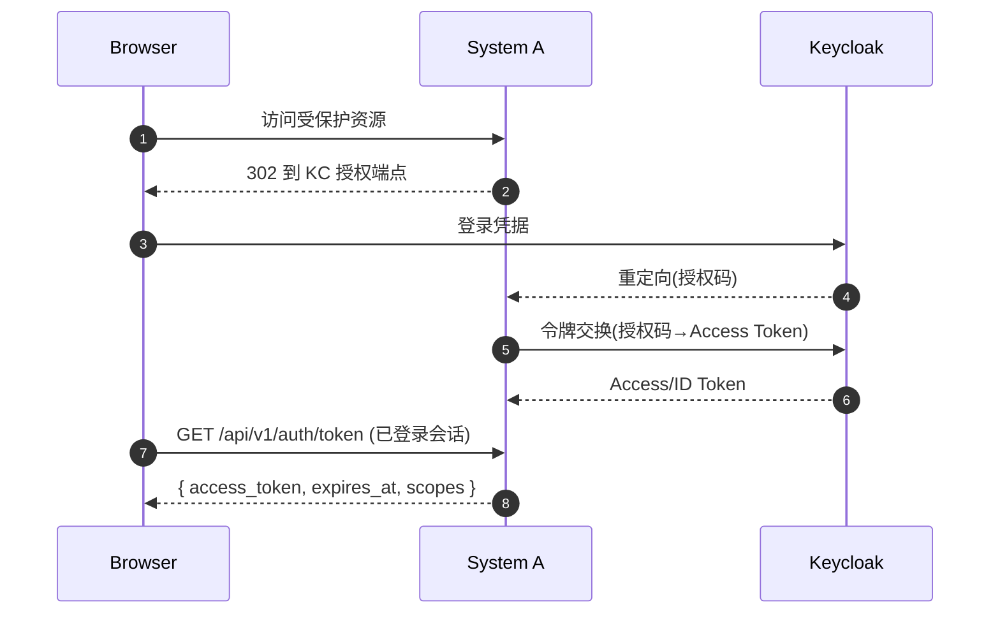
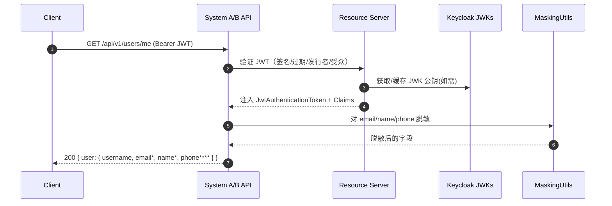
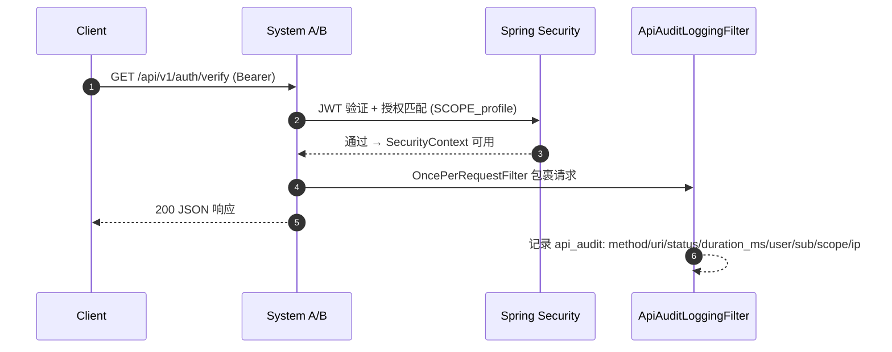

# API 验证与实现说明（身份校验 / 脱敏查询 / 权限与日志）

本文档说明为满足以下三项验证而新增/调整的 Java 代码、端点、权限与日志设计：
- 1) 提供标准 API 接口供第三方应用进行身份校验
- 2) 提供安全的 API 接口查询脱敏用户信息
- 3) 对 API 调用进行权限控制和日志记录

适用于两个系统（system-a 与 system-b），两端实现对称，文件与端点前缀仅上下文路径不同。

## 目录与文件

- 身份校验接口（第三方使用）
  - `system-a/src/main/java/com/example/systema/controller/AuthController.java`
  - `system-b/src/main/java/com/example/systemb/controller/AuthController.java`
- 脱敏用户信息接口
  - `system-a/src/main/java/com/example/systema/controller/UserController.java`
  - `system-b/src/main/java/com/example/systemb/controller/UserController.java`
- 脱敏工具类
  - `system-a/src/main/java/com/example/systema/util/MaskingUtils.java`
  - `system-b/src/main/java/com/example/systemb/util/MaskingUtils.java`
- API 审计日志过滤器
  - `system-a/src/main/java/com/example/systema/filter/ApiAuditLoggingFilter.java`
  - `system-b/src/main/java/com/example/systemb/filter/ApiAuditLoggingFilter.java`
- 安全配置（启用资源服务器 / 授权规则 / 统一登出）
  - `system-a/src/main/java/com/example/systema/config/SecurityConfig.java`
  - `system-b/src/main/java/com/example/systemb/config/SecurityConfig.java`

## 端点清单

- 身份校验（第三方）
  - `GET /system-a/api/v1/auth/verify`
  - `GET /system-b/api/v1/auth/verify`
  - 作用：校验传入的 Bearer JWT 是否有效，并返回主体关键信息（`sub/preferred_username/email/scope/iat/exp/iss/aud`）。
  - 权限：需要 `SCOPE_profile`。

- 调试获取 Token（可选，便于本地联调）
  - `GET /system-a/api/v1/auth/token`
  - `GET /system-b/api/v1/auth/token`
  - 作用：在已登录 Web 会话下返回当前会话 Access Token，便于复制给第三方调用。
  - 权限：仅需会话已登录（不强制 `SCOPE_profile`）。

- 脱敏用户信息
  - `GET /system-a/api/v1/users/me`
  - `GET /system-b/api/v1/users/me`
  - 作用：返回当前主体基本信息，且对敏感字段做脱敏处理（邮箱、姓名、手机号）。
  - 权限：需要 `SCOPE_profile`。

## 主要类与职责说明

### AuthController（身份校验）
- 文件：`controller/AuthController.java`
- 路由前缀：`/api/v1/auth`
- 端点：
  - `GET /verify`：从安全上下文中解析 `JwtAuthenticationToken`，提取 `sub`、`preferred_username`、`email`、`scope`、`iat/exp`、`iss/aud` 并返回；如非 JWT 认证但存在会话认证，则返回 `principal`。
  - `GET /token`：便于调试，在已登录 Web 会话下通过 `@RegisteredOAuth2AuthorizedClient("keycloak")` 取出当前授权客户端的 Access Token，返回 `access_token/token_type/expires_at/scopes`。
- 适用目标：满足“1. 提供标准 API 供第三方进行身份校验”。

### UserController（脱敏用户信息）
- 文件：`controller/UserController.java`
- 路由前缀：`/api/v1/users`
- 端点：
  - `GET /me`：从 JWT 中获取 `preferred_username/email/name/phone_number`，通过 `MaskingUtils` 进行脱敏后返回（用户名原样；邮箱保留首尾字符，其余打星；姓名仅保留首字符；手机号仅保留后 4 位）。若为会话认证但非 JWT，则最少返回 `username`。
- 适用目标：满足“2. 提供安全的 API 接口查询脱敏用户信息”。

### MaskingUtils（脱敏工具）
- 文件：`util/MaskingUtils.java`
- 方法：
  - `maskEmail(String)`：对邮箱名部分中间打星，保留首尾字符；无 `@` 时原样返回。
  - `maskName(String)`：保留首字符，其余打星；单字符姓名结尾补星。
  - `maskPhone(String)`：仅保留后 4 位，其余打星。
- 作用：集中管理脱敏策略，便于复用与后续替换。

### ApiAuditLoggingFilter（API 审计日志）
- 文件：`filter/ApiAuditLoggingFilter.java`
- 逻辑：
  - 仅拦截 URI 含 `/api/` 的请求（避免干扰页面与静态资源）。
  - 记录字段：`method/uri/status/duration_ms/user/sub/scope/azp/ip`。
  - 从 `JwtAuthenticationToken` 解析 `preferred_username/sub/scope/azp`，无 JWT 时记录会话用户名。
  - 使用 `OncePerRequestFilter` 保证每次请求仅记录一次。
- 适用目标：满足“3. 对 API 调用进行日志记录”，便于审计与排查。

### SecurityConfig（权限控制与资源服务器）
- 文件：`config/SecurityConfig.java`
- 关键点：
  - 启用资源服务器：`.oauth2ResourceServer(oauth2 -> oauth2.jwt(...))`，基于 Keycloak 的 JWT 进行鉴权。
  - 路由授权：
    - 公开：`/`、`/home`、静态资源；（可选）`/v3/api-docs/**`、`/swagger-ui/**`。
    - 已登录即可：`/api/v1/auth/token`（便于获取令牌）。
    - 需要 `SCOPE_profile`：`/api/v1/auth/**`（除 `/token`）、`/api/v1/users/**`。
  - 统一登出：`OidcClientInitiatedLogoutSuccessHandler`，登出后跳转 `{baseUrl}/system-*/`，实现与 Keycloak 的 OIDC 端点联动。
- 适用目标：满足“3. 对 API 调用进行权限控制”，并与 Keycloak 统一认证登出保持一致。

## 请求示例

- 身份校验（System B）：
  - 请求：`GET http://localhost:8082/system-b/api/v1/auth/verify`，头：`Authorization: Bearer <ACCESS_TOKEN>`
  - 成功返回：`200`，JSON 含 `active/sub/preferred_username/email/scope/iat/exp/iss/aud/system`。

- 脱敏信息（System B）：
  - 请求：`GET http://localhost:8082/system-b/api/v1/users/me`，头：`Authorization: Bearer <ACCESS_TOKEN>`
  - 成功返回：`200`，JSON 中 `user.email/name/phone` 为打星脱敏值。

## 排错建议

- 401 Unauthorized：
  - 未带 Bearer、令牌格式错误（包含尖括号/换行）、令牌过期。
  - system-* 服务未重启加载新配置。

- 403 Forbidden：
  - 令牌缺少 `profile` scope。请用系统 `/api/v1/auth/token` 获取的令牌或在 Keycloak 客户端配置默认范围。

- 审计日志：
  - 在应用日志中搜索 `api_audit` 可查看最近一次 API 调用的用户与 scope 信息，辅助定位问题。

## 与 Keycloak 的交互关系与信任边界

### 整体机制
- 信任来源：Keycloak 发行 Access Token（JWT）；应用作为资源服务器基于 `issuer-uri` 自动发现 JWK 公钥，离线验证签名、`iss/aud/exp` 等，无需每次回源 Keycloak。
- 认证结果：验证通过后，Spring Security 将 `JwtAuthenticationToken` 放入 `SecurityContext`，控制器与过滤器仅读取已验证的 Claims。
- 统一登出：通过 OIDC RP‑Initiated Logout 调用 Keycloak end-session，实现 Keycloak 与本地会话的统一登出。

### 各文件与 Keycloak 的关系
- `AuthController`（/api/v1/auth）
  - `/verify`：不直接请求 Keycloak；依赖前置资源服务器的 JWT 验证，读取 Claims（`sub/preferred_username/email/scope/iat/exp/iss/aud`）并返回，供第三方做身份校验。
  - `/token`：不向 Keycloak 发新请求；从已登录 Web 会话的 `OAuth2AuthorizedClient` 读取 Access Token 回显，便于联调。
- `UserController`（/api/v1/users/me）
  - 不直接请求 Keycloak；从 JWT Claims 读取 `preferred_username/email/name/phone_number` 并脱敏返回。
  - 依赖 Keycloak Scope/Protocol Mapper：`profile/email` Scope 会携带标准 OIDC Claims；`phone_number` 如需出现需在 Keycloak 配置自定义 Protocol Mapper。
- `MaskingUtils`
  - 与 Keycloak 无直接交互；仅对从 JWT 获取的字段做本地脱敏。
- `ApiAuditLoggingFilter`
  - 不直接请求 Keycloak；从 `SecurityContext` 获取 `JwtAuthenticationToken`，记录 `user/sub/scope/azp` 等审计字段与请求/响应元数据。
- `SecurityConfig`
  - 资源服务器：`.oauth2ResourceServer().jwt(...)` 通过 `issuer-uri` 自动下载 OIDC 配置与 JWK 公钥，验证每个 Bearer JWT。
  - 授权规则：使用 `JwtGrantedAuthoritiesConverter` 将 `scope` 映射为 `SCOPE_xxx`，限制 `/api/v1/auth/**`（除 `/token`）与 `/api/v1/users/**` 需 `SCOPE_profile`。
  - OAuth2 Login：浏览器登录走授权码流，应用用授权码向 Keycloak 换取令牌并建立本地会话（供 `/auth/token` 使用）。
  - OIDC 统一登出：`OidcClientInitiatedLogoutSuccessHandler` 调用 Keycloak end-session 并设置 `postLogoutRedirectUri`。

### 关键配置依赖（在 Keycloak 侧）
- 客户端与回调：确保客户端的 Redirect URI、Post‑logout Redirect URI 与应用一致。
- Scope：默认授权范围包含 `profile,email`，以便令牌内包含必要 Claims 并满足 `SCOPE_profile` 授权。
- Claims 映射（Protocol Mapper）：若需自定义字段（如 `phone_number`），在客户端/Realm 配置相应 Mapper。
- JWK 公钥/发现：确保 `issuer-uri` 可访问，以便应用获取 JWK 公钥用于离线验签。

### 未启用但可扩展的交互
- Token Introspection：当前未调用 Keycloak 的 introspection 端点（采用离线验签）。若需实时撤销感知，可补充启用（权衡性能）。
- UserInfo 回源：当前 `/users/me` 不调用 `userinfo` 拉取实时资料；若需实时属性，可在端点中追加后端调用。

### 小结
新加的三个功能点在运行时均不直接向 Keycloak 发请求（除统一登出及初始授权码换令牌），而是依赖资源服务器对 JWT 的本地验签与解析，再基于 Claims 实现身份校验、脱敏输出与审计；权限控制同样依赖 Keycloak 下发的 `scope`/Claims。

## 交互时序图

### 1) 第三方身份校验（/api/v1/auth/verify）

可选：获取调试用 Token（Web 会话）

### 2) 脱敏用户信息（/api/v1/users/me）

### 3) 权限控制与审计日志

